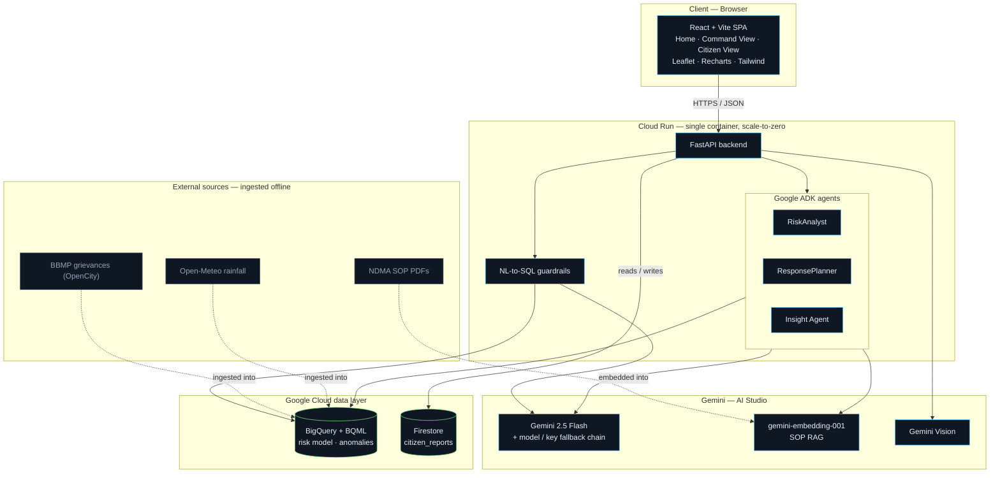
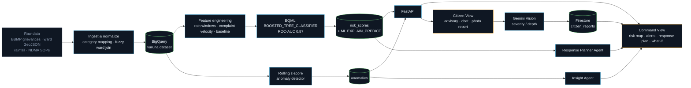
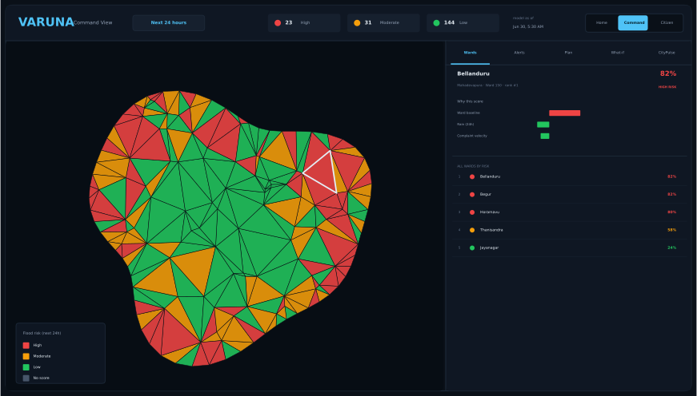
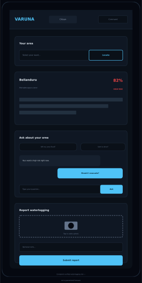

<div align="center">

# VARUNA
### Flood Decision Intelligence Platform

**W**ard-level **A**nalytics, **R**isk & **U**rban **N**owcasting **A**gent — named for *Varuna*, the Vedic deity of water.

Citizen complaints are a city's largest untapped sensor network.
**VARUNA turns them into predictive flood infrastructure.**

[](https://varuna-229692962627.asia-south1.run.app)


[**Live Demo**](https://varuna-229692962627.asia-south1.run.app) ·
[**Video Walkthrough**](https://drive.google.com/drive/folders/1G7pZisYnW9c-d7P_oV_YNEpQpmXj1EVy?usp=drive_link) ·
[Architecture](#architecture) ·
[Getting Started](#getting-started)

</div>

---

## Table of contents

- [Overview](#overview)
- [Live demo](#live-demo)
- [Video walkthrough](#video-walkthrough)
- [Features](#features)
- [Architecture](#architecture)
- [Process flow](#process-flow)
- [Wireframes](#wireframes)
- [Data, models & AI in use](#data-models--ai-in-use)
- [Risk model performance](#risk-model-performance)
- [Tech stack](#tech-stack)
- [Folder structure](#folder-structure)
- [Getting started](#getting-started)
- [Environment variables](#environment-variables)
- [Deployment](#deployment)
- [Honest limitations](#honest-limitations)
- [Author](#author)

---

## Overview

Most civic flood tools are reactive — a citizen files a complaint, and a system routes
it. **VARUNA is proactive.** It fuses three signals nobody else combines for the same
city:

1. **Weather** — rainfall forecasts + 5+ years of historical rainfall (Open-Meteo).
2. **Infrastructure** — official flood-prone / low-lying location data (BBMP).
3. **The human sensor network** — 5+ years of real citizen grievance data (766,648
   records). A spike in waterlogging complaints in a ward is an early-warning signal
   that can fire *hours* before a rainfall model alone would flag risk.

On top of that data foundation sit a trained BigQuery ML risk model, a rolling
anomaly detector, three Google ADK agents, and two purpose-built views — one for
city control-room officers, one for residents. Prototyped end-to-end on **Bengaluru**;
the data model and city configuration are generic enough to onboard any Urban Local
Body (ULB) in India.

## Live demo

**https://varuna-229692962627.asia-south1.run.app**

Deployed on Google Cloud Run (scale-to-zero). Opens on a **Home** overview; use the
view switcher to explore **Command View** (control room) and **Citizen View**
(resident-facing).

## Video walkthrough

A recorded walkthrough of the platform is available here:

**[Watch the demo video](https://drive.google.com/drive/folders/1G7pZisYnW9c-d7P_oV_YNEpQpmXj1EVy?usp=drive_link)**

<!-- Once the final video is uploaded, this is a good place to also embed a
     thumbnail/GIF, e.g.: [](https://youtu.be/...) -->

## Features

| | |
|---|---|
| **Ward-level risk map** | All 198 Bengaluru wards scored for flood risk over the next 24h, with a click-through panel that explains *why* each ward is at risk via per-ward model feature attributions. |
| **Anomaly feed — citizens as sensors** | Detects wards where flood complaints spike far above their seasonal baseline — an early-warning that can fire before rainfall models, surfacing cases the risk model rated only "moderate." |
| **Insight agent** | A Google ADK agent investigates each anomaly: correlates rainfall, compares neighbouring wards, checks the model's rating, and writes an explainable alert brief. |
| **SOP-grounded response planner** | A Google ADK agent reads live risk, searches official NDMA flood-management SOPs, allocates (simulated) resources, and drafts a prioritized action plan where every action cites the SOP page that justifies it — plus a citizen advisory. |
| **CityPulse analytics** | Ask 5+ years of grievances in plain English → guarded SQL over BigQuery → chart + narrative answer. |
| **What-if simulator** | Push a hypothetical storm (mm / duration / zone) through the trained model and watch the risk map re-score live. |
| **Citizen reporting** | Residents upload a waterlogging photo → Gemini Vision estimates severity & water depth → geotagged → appears live on the control-room map. |
| **Grounded citizen assistant** | Locate your ward, get a safety advisory, and ask questions answered from your ward's real risk + rainfall — not a generic chatbot. |

## Architecture



One container serves both the API and the built React app; it scales to zero when
idle. There are no always-on VMs, no Vertex AI endpoints, and no managed vector DB —
the SOP RAG index is a small embedded file, and Gemini is called via the AI Studio
API (not Vertex), keeping the whole platform inside the free tier.

## Process flow

How raw civic data becomes a live decision on the map — and how citizen reports feed
back into the loop:



Note the loop on the right: a citizen's photo report is analyzed by Gemini Vision,
stored in Firestore, and appears back on the Command View map within seconds —
closing the "citizens as sensors" feedback loop.

## Wireframes

Mockups of the two purpose-built views, matching the live product's layout and design
system.

<table>
<tr>
<th>Command View — control room (desktop)</th>
<th>Citizen View — resident (mobile)</th>
</tr>
<tr>
<td></td>
<td></td>
</tr>
</table>

## Data, models & AI in use

**Data (all real & public, ingested → normalized → BigQuery):**
- 766,648 BBMP grievances (2020–2025), ward-tagged & categorized
- 198-ward BBMP boundaries (GeoJSON)
- 270 flood-prone + 129 low-lying hazard points
- 385,536 hourly rainfall records (Open-Meteo, 8 zone grid points)
- 2 NDMA flood-management SOP PDFs → 200 embedded chunks for RAG

**Models trained:**
- **BigQuery ML `BOOSTED_TREE_CLASSIFIER`** — ward flood-risk model, temporal
  train/val/test split, `ML.EXPLAIN_PREDICT` for per-ward feature attributions.
- **Rolling z-score anomaly detector** — flags per-(ward, category) daily complaint
  counts that spike far above a trailing baseline.

**AI in use:**
- **Gemini 2.5 Flash** — NL-to-SQL generation, narrative answers, and agent reasoning
  (with an automatic model/key fallback chain so the app survives per-model quota).
- **`gemini-embedding-001`** — SOP retrieval-augmented generation (cosine similarity).
- **Google ADK** — three agents: RiskAnalyst, ResponsePlanner, Insight.
- **Gemini Vision** — citizen photo severity / water-depth extraction.

## Risk model performance

Trained on data ≤2023, validated on 2024, tested on 2025 (including the real
May-2025 red-alert event). Heavy class imbalance (~1–2.5% positive) means PR-AUC and
recall@top-20 are the meaningful metrics, not accuracy.

| split | ROC-AUC | PR-AUC | recall@top-20 wards/day |
|---|---|---|---|
| val (2024) | 0.866 | 0.158 | 0.563 |
| test (2025) | 0.866 | 0.207 | 0.594 |

PR-AUC is ~8–10× the positive base rate. Sanity check: the top-ranked wards
(Bellandur, Begur, Horamavu) are well-known Bengaluru flooding hotspots. Full report:
[`ml/eval_report.md`](ml/eval_report.md).

## Tech stack

| Layer | Technology |
|---|---|
| Frontend | React 18, Vite, Tailwind CSS, react-leaflet, Recharts |
| Backend | Python 3.11, FastAPI, Uvicorn |
| Warehouse + ML | BigQuery, BigQuery ML (`BOOSTED_TREE_CLASSIFIER`) |
| Agents | Google Agent Development Kit (ADK) |
| LLM | Gemini 2.5 Flash family (Google AI Studio, not Vertex) |
| Real-time store | Firestore (native mode) |
| Deployment | Docker (multi-stage) → Cloud Run, `asia-south1`, scale-to-zero |
| External data | BBMP grievances (OpenCity), Open-Meteo, NDMA SOP PDFs |

## Folder structure

```text
VARUNA/
├── backend/                      FastAPI application (deployed to Cloud Run)
│   ├── agents/                    Google ADK agents + SOP RAG
│   │   ├── orchestrator.py          RiskAnalyst · ResponsePlanner · Insight agent definitions
│   │   ├── tools.py                 Tool functions exposed to agents (BigQuery + RAG)
│   │   ├── sop_rag.py                Cosine-similarity search over the SOP embedding index
│   │   └── sop_index.json            Pre-computed NDMA SOP chunk embeddings (bundled)
│   ├── routers/                   API endpoints
│   │   ├── risk.py                   Ward risk map, ranking, explainability
│   │   ├── citypulse.py               NL-to-SQL analytics chat
│   │   ├── agents.py                  Response plan / situation / investigate endpoints
│   │   ├── anomalies.py               Complaint-anomaly feed
│   │   ├── whatif.py                  Rainfall what-if simulator
│   │   ├── citizen.py                 Locate / advisory / ask (Citizen View)
│   │   └── reports.py                 Citizen photo report → Vision → Firestore
│   ├── services/                  Shared infra clients
│   │   ├── bq.py                      BigQuery client + query helpers
│   │   ├── gemini.py                  Gemini client with model/key fallback chain
│   │   ├── firestore.py               Firestore client
│   │   ├── nl2sql.py                  NL-to-SQL guardrails
│   │   └── settings.py                Env/config loader (city configs, Gemini chain)
│   └── main.py                     FastAPI app entrypoint
├── frontend/                     React + Vite single-page app
│   └── src/
│       ├── views/                    HomeView · CommandView · CitizenView
│       ├── components/               RiskMap, WardPanel, Anomalies, ResponsePlan, WhatIf, CityPulse, ...
│       ├── lib/                      Formatting helpers
│       └── api.js                    Backend API client
├── ingestion/                    Data pipeline (grievances, ward geometry, rainfall, SOPs)
│   ├── download_data.py              Pulls raw datasets per city manifest
│   ├── normalize_geo.py              Ward KML/GeoJSON → canonical geometry
│   ├── normalize_grievances.py       Category mapping + fuzzy ward-name join
│   ├── openmeteo_puller.py           Historical + forecast rainfall
│   ├── load_bigquery.py              Loads processed data into BigQuery
│   ├── build_sop_index.py            Downloads & embeds NDMA SOP PDFs for RAG
│   ├── run_pipeline.py               One-command data foundation runner
│   └── bq_schema.sql                 BigQuery table definitions
├── ml/                            Model training & evaluation
│   ├── build_features.py             Feature engineering (risk_features table)
│   ├── train_and_eval.py             Trains the BQML risk model, writes risk_scores
│   ├── build_anomalies.py            Rolling z-score anomaly detector
│   └── eval_report.md                Model evaluation metrics
├── configs/                      Per-city configuration (multi-city ready)
│   └── bengaluru.yaml
├── docs/
│   └── wireframes/                  UI mockups referenced in this README
├── data/processed/                Small committed samples + join/category audit reports
├── deploy/README.md                Cloud Run deploy notes
├── Dockerfile                      Multi-stage build (Node → frontend, Python → API)
├── requirements.txt                 Backend runtime dependencies
├── requirements-ingest.txt          Data pipeline dependencies
├── .env.example                     Environment variable template
└── CLAUDE.md                        Full project plan / build log
```

## Getting started

### Prerequisites

- **Python 3.11+**
- **Node.js 20+** and npm
- A **Google Cloud project** with billing enabled, and the [`gcloud` CLI](https://cloud.google.com/sdk/docs/install) authenticated
- A **Gemini API key** from [Google AI Studio](https://aistudio.google.com/) (free tier)

### 1. Clone & install

```bash
git clone https://github.com/darshanbhavsar01/VARUNA-Flood-Decision-Intelligence-Platform.git
cd VARUNA-Flood-Decision-Intelligence-Platform

# Backend
python -m venv .venv
source .venv/bin/activate        # Windows: .venv\Scripts\activate
pip install -r requirements.txt

# Frontend
cd frontend && npm install && cd ..
```

### 2. Configure environment

```bash
cp .env.example .env
```

Fill in `GEMINI_API_KEY` and `GOOGLE_CLOUD_PROJECT` at minimum (see
[Environment variables](#environment-variables) for the full list).

### 3. Frontend-only development (fastest path)

The frontend's dev server (`import.meta.env.DEV`) points at the **live deployed
API** by default (see `frontend/src/api.js`), so you can work on the UI immediately
with zero backend/GCP setup:

```bash
cd frontend
npm run dev
```

Open the printed local URL — you're live-editing the UI against real deployed data.

### 4. Full local stack (backend + your own data)

To run the backend (and eventually the whole app) against your own GCP project:

```bash
# One-time: authenticate & enable APIs
gcloud auth application-default login
gcloud services enable bigquery.googleapis.com firestore.googleapis.com \
  run.googleapis.com cloudbuild.googleapis.com --project=$GOOGLE_CLOUD_PROJECT
gcloud firestore databases create --location=asia-south1 --type=firestore-native

# Build the data foundation (downloads real BBMP/rainfall/SOP data,
# normalizes it, and loads BigQuery — see ingestion/README.md for details)
pip install -r requirements-ingest.txt
python ingestion/run_pipeline.py --city bengaluru --load-bq
python ingestion/build_sop_index.py

# Train the risk model + anomaly detector
python ml/build_features.py --city bengaluru
python ml/train_and_eval.py --city bengaluru
python ml/build_anomalies.py --city bengaluru

# Run the backend
uvicorn backend.main:app --reload --port 8080
```

Then either:
- point the frontend dev server at `http://localhost:8080` (edit the `BASE` constant
  in `frontend/src/api.js`), or
- build the frontend (`cd frontend && npm run build`) and open
  **http://localhost:8080** directly — FastAPI serves the built app and the API from
  the same origin, exactly like production.

See [`ingestion/README.md`](ingestion/README.md) for the full data-pipeline
walkthrough and honest data-quality notes (ward-join rate, category normalization).

## Environment variables

| Variable | Required | Description |
|---|---|---|
| `GEMINI_API_KEY` | Yes | Primary Google AI Studio API key. |
| `GEMINI_BACKUP_KEYS` | No | Comma-separated backup keys (other AI Studio accounts), tried after the primary key's whole model chain is exhausted. |
| `GEMINI_MODELS` | No | Comma-separated model fallback chain. Defaults to a 6-model chain spanning Gemini 2.0/2.5 Flash variants. |
| `GOOGLE_CLOUD_PROJECT` | Yes | Your GCP project ID (BigQuery + Firestore). |
| `BQ_DATASET` | No | BigQuery dataset name. Defaults to `varuna`. |
| `BQ_LOCATION` | No | BigQuery / Firestore region. Defaults to `asia-south1`. |

## Deployment

Single command from the repo root (builds the frontend in a Node stage, then the
Python API image, and deploys to Cloud Run):

```bash
set -a; source .env; set +a
gcloud run deploy varuna --source . \
  --project=$GOOGLE_CLOUD_PROJECT --region=asia-south1 \
  --allow-unauthenticated --min-instances=0 --memory=1Gi --timeout=120 --quiet \
  --set-env-vars="^##^GEMINI_API_KEY=${GEMINI_API_KEY}##GEMINI_MODELS=${GEMINI_MODELS}##GOOGLE_CLOUD_PROJECT=${GOOGLE_CLOUD_PROJECT}##BQ_DATASET=varuna##BQ_LOCATION=asia-south1"
```

Full notes (cost controls, IAM, gotchas) in [`deploy/README.md`](deploy/README.md).

## Honest limitations

- **Complaint proxy bias** — waterlogging risk is trained on citizen complaints,
  which over-represent affluent/tech corridors that report more. The model controls
  for ward reporting propensity, but the bias is real. Framed as *complaint-verified
  waterlogging risk*, not "flood prediction."
- **Model leans on ward baseline** — the strongest feature is `ward_flood_baseline`
  (gain ≈ 0.58), i.e. the model partly learns "which wards habitually complain."
  Rainfall and citizen-complaint velocity are the next-strongest features, and
  notably `velocity_prev_3d` (the human-sensor signal) outranks the rain forecast.
- **No drain-network data** — no public drain shapefile or real-time drain sensors
  exist; the architecture is "sensor-ready" for when they do.
- **Ward-name joins** — grievance ward strings vs. GeoJSON ward names require fuzzy
  matching; residual mismatches are documented in the join report
  (`data/processed/ward_join_report.md`).
- **Simulated elements** — the emergency resource inventory (pumps/crews) used by the
  Response Planner is clearly labeled *simulated* in both the UI and the code.

## Author

Built by **[Darshan Bhavsar](https://www.linkedin.com/in/darshan01/)**.
